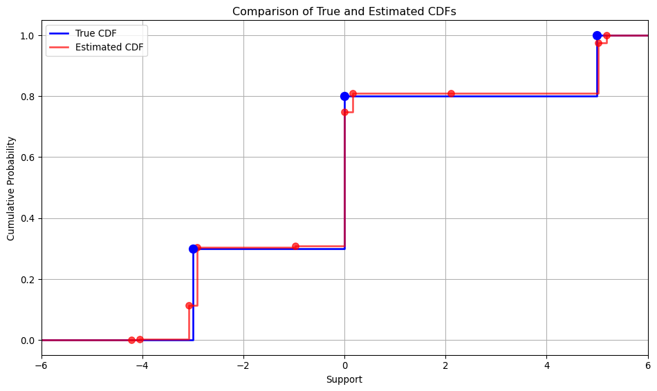

# SPMLEX: Semi-parametric Maximum Likelihood Estimation

`spmlex` is a Python package for semi-parametric maximum likelihood
estimation with [Jax](https://github.com/jax-ml/jax). It provides a
computationally efficient method for estimating economic models with
permanent unobserved heterogeneity.

## Background

This package implements the estimator described in Section 5 of

> Bunting, Jackson, Paul Diegert, and Arnaud Maurel (2025).
> “Heterogeneity, Uncertainty and Learning: Semiparametric
> Identification and Estimation”

This provides a method for estimating models that have a log-likelihood
function that can be written as
$\mathcal{L}(w^n; \theta, F) = \sum_i^n \log \ell(w_i; \theta, F)$,
where $\theta$ is a finite-dimensional vector of parameters, $F$ is a
cdf function, and the likelihood contributions have the form,

$$
\ell(w; \theta, F) = \int G(w, v; \theta)dF(v)
$$

The distribution $F$ is approximated by a discrete distribution with a
fixed grid of support (we call this space $F_n$), and we
optimize the *profile log-likelihood* function which is the likelihood
evaluated at $\theta$ and $F^{\*}(\theta)$ (the value of $F$ which
maximizes the likelihood given $\theta$):

$$
L^{\*}(\theta) = \max_{F \in F_n} \sum_{i=1}^n \log \int G(w_i, v; \theta) dF(v)
$$

This is a two-step optimization problem. The inner optimization problem
of finding the optimal $F$ is a well-studied convex optimization
problem, with efficient computational solutions. For the inner
optimization problem, this package uses the companion package `mixsqpx`,
which implements the mixSQP algorithm described in,

> Kim, Y., Carbonetto, P., Stephens, M., & Anitescu, M. (2020). A Fast
> Algorithm for Maximum Likelihood Estimation of Mixture Proportions
> Using Sequential Quadratic Programming. Journal of Computational and
> Graphical Statistics, 29(2), 261–273.

`mixsqpx` was ported from the [R
implementation](https://github.com/stephenslab/mixSQP) of this paper by
the authors which uses the Rarmadillo package as an interface to the
Armadillo C++ library. `mixsqpx` provides a `jax`-compatible interface
to the mixSQP algorithm in Python, which makes it possible to use the
tools in the `jax` ecosystem to maximize the profile likelihood function
over $\theta$.

This package (`spmlex`) implements the implicit differentiation
algorithm described in appendix B.4.1 in Bunting et al. (2025). Using
this along with the automatic differentiation capabilities in `jax`,
this package allows the user to automatically differentiate a profile
log-likelihood function with respect to $\theta$ and accelerate
compuation with the just-in-time (jit) compilation. The user simply has
to provide a function implemented in `jax` that takes $\theta$, the
data, and a grid of support for the latent variable and returns a matrix
representing the log likelihood contribution for each observation
conditional on each support point for the latent variable.

## Installation

We use the [Pixi](https://github.com/prefix-dev/pixi) package manager to
handle installation and dependencies.

### Linux Installation

``` bash
# Install pixi if you don't have it already
curl -fsSL https://pixi.sh/install.sh | bash

# Clone the repository
git clone https://github.com/pdiegert/spmlex.git
cd spmlex

# Install dependencies and build the package
pixi install
```

### Windows Installation

``` powershell
# Install pixi if you don't have it already
iwr -useb https://pixi.sh/install.ps1 | iex

# Clone the repository
git clone https://github.com/pdiegert/spmlex.git
cd spmlex

# Install dependencies and build the package
pixi install
```

### Verification

Run the test suite to verify your installation:

``` bash
pixi run test
```

## Example usage

To illustrate the use of the package, we will walk through an example of
estimating a Gaussian mixture model with panel data. The model is,

$$
Y_{it} = \lambda_t X_i^* + e_{it}
$$

where $e_{it} \sim N(0, \sigma_t^2)$ and are mutually independent and
independent of $X^*$.

We define the model with an `equinox` Module which stores the finite
parameters of the model $\theta$ and provides methods `simulate` to
simulate data and `lclk` (Log Conditional Likelihood), which returns the
likelihood conditional on a grid of support points for the latent
variable $X^*$.

``` python
import jax
import jax.numpy as np
import equinox as eqx

class LinearFactor(eqx.Module):
    coef: np.ndarray
    log_std_e: np.ndarray

    def simulate(self, data, *, rng):
        latent = data["latent"]
        nobs, *_ = latent.shape
        nperiod = self.log_std_e.shape[0]

        coef = np.concat([np.array([1.0]), self.coef])

        e = jax.random.normal(rng, shape=(nobs, nperiod)) * np.exp(self.log_std_e)
        outcomes = latent[:, None] * coef[None, :] + e

        return {"outcomes": outcomes}

    def lclk(self, data, supp):
        outcomes = data["outcomes"]  # (obs, period)

        coef = np.concat([np.array([1.0]), self.coef])

        deviation = (
            outcomes[:, :, None] - supp[None, None, :] * coef[None, :, None]
        )

        lclk_ = -0.5 * (
            np.log(2 * np.pi)
            + 2 * self.log_std_e.sum()
            + ((deviation / np.exp(self.log_std_e)[None, :, None]) ** 2).sum(axis=1)
        )

        return lclk_
```

Having defined the model, we can now set the parameter values used in
the true DGP,

``` python
coef = np.array([1.5, 0.3])
log_std_e = np.array([0.0, 0.2, -0.3])

linear_factor = LinearFactor(coef=coef, log_std_e=log_std_e)
```

The non-parametric part of the model is the distribution of $X^*$. For
the true DGP, we use a discrete distrubution. Since we estimate this
distribution non-parametrically, we only need to provide a `simulate`
method for this distribution.

``` python
class Discrete(eqx.Module):
    supp: np.ndarray
    weights: np.ndarray

    def simulate(self, *, rng, n: int):

        component_indices = jax.random.choice(
            rng, np.arange(len(self.supp)), shape=(n,), p=self.weights
        )

        samples = self.supp[component_indices]

        return {"latent": samples}
```

Keeping things simple, we set $X^*$ to three support points,

``` python
supp = np.array([-3.0, 0., 5.0])
weights = np.array([0.3, 0.5, 0.2])

discrete = Discrete(supp=supp, weights=weights)
```

Next we simulate data from the model with a sample size of $2,000$

``` python
nobs = 2000

# Generate data from the mixture
key = jax.random.PRNGKey(0)

key, subkey = jax.random.split(key)
data = discrete.simulate(rng = subkey, n = nobs)

key, subkey = jax.random.split(key)
data = linear_factor.simulate(data, rng = subkey)
```

### Estimation of $F$

To estimate the parameters of the model, we need to define a grid of
support for $X^*$. Here, we define an equally spaced grid of $75$
support points,

``` python
supp_grid = np.linspace(-6.0, 6.0, 75)
```

The main function that `spmlex` provides is `profile_ll`, which
calculates the profile likelihood function $\mathcal{L}^*(\theta)$ as
defined above.

This function takes three arguments: the model object `linear_factor`
which contains the finite parateters $\theta$ and implements the method
`lckl` (Log Conditional Likelihood), the data, and a grid of support for
the latent variable. It returns the log-likelihood evaluated at $\theta$
and $F^{\*}(\theta)$ (the optimal value of $F$ at $\theta$) and the
vector of probabilities corresponding to the support points of $X^*$.

``` python
from spmlex import profile_ll

ll, probs = profile_ll(linear_factor, data, supp_grid)
```

At the true values of $\theta$, the estimated probabilities $\theta$ are
very close to the true probabilities of the mixing distribution. This is
what we get plotting the CDF of the estimated $F$ compared to the DGP,

<details class="code-fold">
<summary>Code</summary>

``` python
import numpy as onp
import matplotlib.pyplot as plt

plt.figure(figsize=(10, 6))

# Calculate the true CDF points from the discrete distribution
true_x = onp.sort(supp)
true_cdf = onp.cumsum(weights)

# Calculate the cumulative sum of probabilities
estimated_cdf = onp.cumsum(probs.flatten())

# Plot true CDF with step function
x_true = onp.concatenate([[-6], true_x, [6]])  # Extended to both axis limits
y_true = onp.concatenate([[0], true_cdf, [1.0]])  # Start at 0, end at 1
plt.step(x_true, y_true, where='post', color='blue', linewidth=2, label='True CDF')

# Plot estimated CDF with step function
nonzero_idx = onp.where(estimated_cdf > 0)[0]
x_est = onp.concatenate([[-6], supp_grid, [6]])
y_est = onp.concatenate([[0], estimated_cdf, [1]])
plt.step(x_est, y_est, where='post', color='red', linewidth=2, alpha=0.7, label='Estimated CDF')

# Add points at the step locations for the true CDF
plt.scatter(true_x, true_cdf, color='blue', s=80, zorder=3)
nonzero = probs.flatten() > 0
plt.scatter(supp_grid[nonzero], estimated_cdf[nonzero > 0], 
                color='red', alpha=0.7, s=50, zorder=2)

# Add labels and title
plt.xlabel('Support')
plt.ylabel('Cumulative Probability')
plt.title('Comparison of True and Estimated CDFs')
plt.xlim(-6, 6)  # Set x-axis limits to match the support grid
plt.ylim(-.05, 1.05)  # Set y-axis limits with a little headroom
plt.legend()
plt.grid(True)
plt.tight_layout()

plt.show()
```

</details>



### Estimation of $\theta$

The function `profile_ll` is a jax-transformable function, so we can use
any of the tools in the JAX ecosystem to optimize it over $\theta$.

For this example, we use the `jaxopt` library to optimize the profile
likelihood function.

We create the solver by providing the profile log-likelihood function
and a few hyperparameters controlling the optimization loop.

``` python
import jaxopt

maxiter = 100
gtol = 1e-6

solver = jaxopt.BFGS(
    fun = profile_ll,
    has_aux=True,
    maxiter=maxiter,
    tol=gtol,
    jit=True,
    unroll="auto",
    linesearch="zoom",
    verbose=False,
)
```

To run the optimizer we need to initialize $\theta$ with some starting
values

``` python
# initialize the coefficients and log_std_e
rng = jax.random.PRNGKey(101)
key, subkey = jax.random.split(rng)
coef0 = jax.random.normal(subkey, shape=(2,)) + 1.0

key, subkey = jax.random.split(key)
log_std_e0 = jax.random.normal(subkey, shape=(3,)) * 0.2

starting_values = {"coef": coef0, "log_std_e": log_std_e0}
starting_values
```

    {'coef': Array([0.59338981, 0.67029804], dtype=float64),
     'log_std_e': Array([ 0.04235583,  0.15424864, -0.52202678], dtype=float64)}

Solving the optimization problem then is simple:

``` python
linear_factor_est, state = solver.run(LinearFactor(**starting_values), data, supp_grid)
```

On an Intel I-9 CPU, this completes in about 10 seconds. The solver is
using the jax just-in-time (jit) compiler to accelerate computations,
along with automatic differentiation to calculate the gradient of the
profile likelihood function. The estimated values of $\theta$ are close
to the DGP,

<details class="code-fold">
<summary>Code</summary>

``` python
print(f"Factor Loadings:\n (Estimate): {linear_factor_est.coef}\n (DGP): {linear_factor.coef}")
print(f"Idiosyncratic Variance:\n (Estimate): {np.exp(linear_factor_est.log_std_e) ** 2}\n (DGP): {np.exp(linear_factor.log_std_e) ** 2}")
```

</details>

    Factor Loadings:
     (Estimate): [1.5166264  0.29513692]
     (DGP): [1.5 0.3]
    Idiosyncratic Variance:
     (Estimate): [1.03415027 1.52428492 0.55158215]
     (DGP): [1.        1.4918247 0.5488116]

## Citations

If you use this package in your research, please cite:

    @article{bunting2024heterogeneity,
      title={Heterogeneity, Uncertainty and Learning: Semiparametric Identification and Estimation},
      author={Bunting, Jackson and Diegert, Paul and Maurel, Arnaud},
      journal={arXiv preprint arXiv:2402.08575},
      year={2025}
    }
